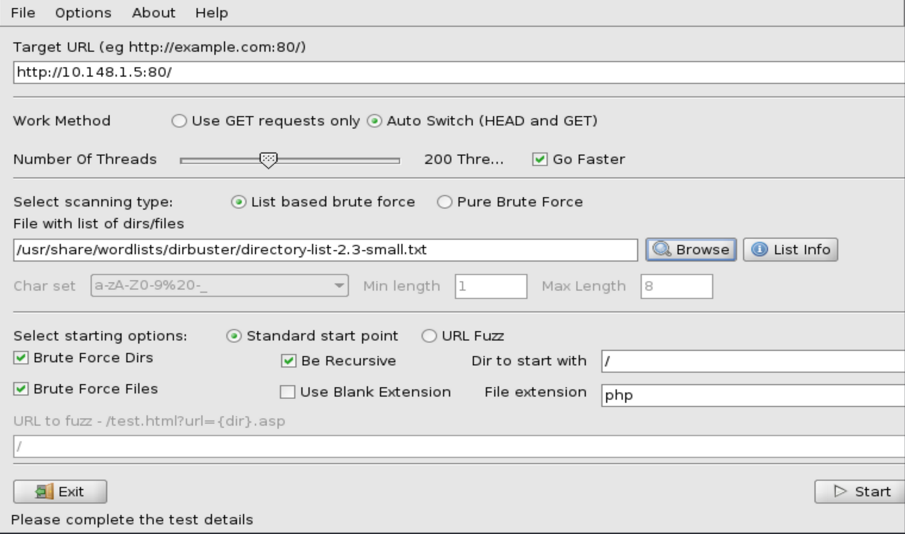

dirbuster

**usage:**
Load up the gui
```
dirbuster&
```


1. Enter the ip address, syntax is important to include the port
2. In this case over the intra-net and our own personal practice we can press go faster and set number of threads to 200
3. wordlist's are located in /usr/share/wordlists/dirbuster/
	1. In this case a small list is fine, but in the cast of a larger target a larger list will be needed
4. You can add to the file extention based on the target,
	1. In the case of a php server, php is great. If the company generates pdf, then maybe that is great,
5. click start

Cheatsheet: zip, txt, tar.gz, php, rar, pdf, docx, xlsx, odt,  asp, aspx