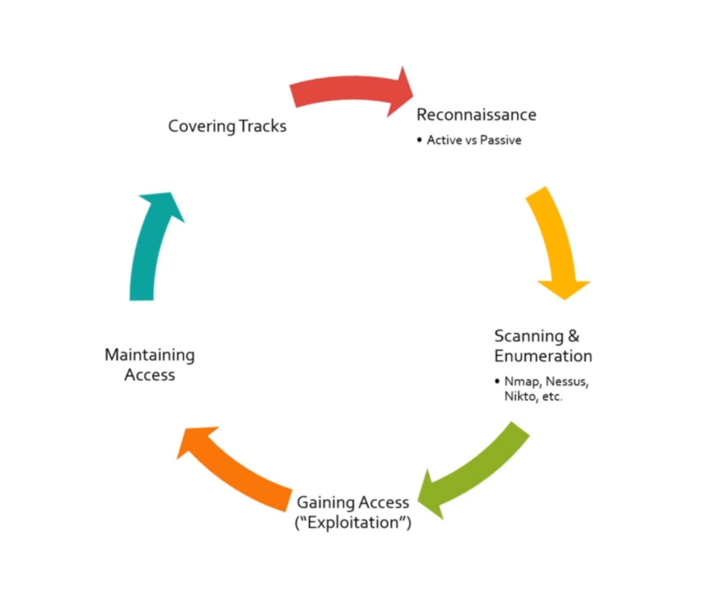

Stages of ethical hacking

# Reconnaissance

- Passive,
    - Looking for badge, name, twitter page, seeing what information you can dig up about a target over teh web
- Active
    - Involves running tools against a potential target, goes hand and hand with the scanning step

# Scanning & Enumeration

- Actively scanning a legal target with Nmap, Nessus, Nikto, or etc depending on the scenario
- Goal is to check for anything out of place
    - Open ports
    - Vulnerabilities
- After this doing enumeration, taking the information you've learning about the target and try too see if anything is vulnerable based on that information.

# Gaining Access

- The exploitation stage is using what we found to actively exploit a system or service.

# Maintaining Access

- If we gain access then we want to be able to setup persistance (assuming that it part of the terms of engagement)

# Covering Tracks

- We then need to cover the tracks of a system so no one discover's that we've entered the network.
    - Delete all the malware you uploaded
    - scrub your logs (this might set off an alert if they're doing their job right)
    - Any accounts you created
    - Just cleanup
- After access us a success, we then repeat in a loop from the system we have access from to gain more access across a network

